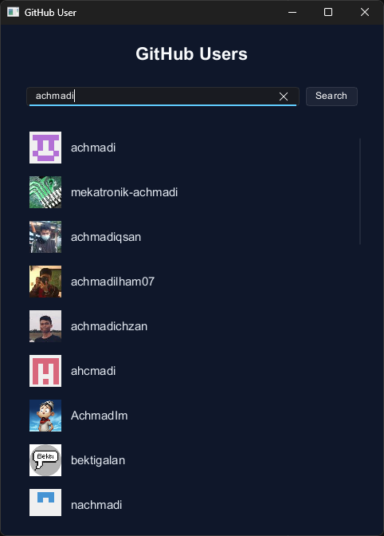
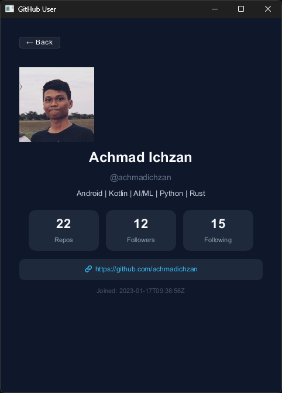

# GitHub User Finder
[](https://deepwiki.com/achmadichzan/github-user)

Sebuah aplikasi desktop sederhana dan cepat untuk mencari pengguna GitHub dan melihat profil mereka. Proyek ini dibangun menggunakan Rust untuk logika *backend* dan *toolkit* antarmuka [Slint](https://slint.dev/) untuk antarmuka grafis (GUI).

## Fitur

-   **Pencarian Pengguna:** Temukan pengguna GitHub dengan namapengguna (username) atau nama asli mereka.
-   **Detail Profil:** Lihat avatar pengguna, nama, bio, tanggal pendaftaran, dan statistik utama (repositori publik, pengikut, yang diikuti).
    
    

-   **Tautan Profil Langsung:** Tautan yang bisa diklik untuk menuju langsung ke halaman profil GitHub pengguna.
    
    

-   **Operasi Asinkron:** Mengambil data pengguna dan avatar dari API GitHub tanpa memblokir antarmuka pengguna, memberikan pengalaman pengguna yang mulus.
-   **UI Modern:** Antarmuka yang bersih, responsif, dengan tema gelap (*dark theme*).

## Teknologi yang Digunakan

-   **Bahasa Pemrograman:** Rust (Edisi 2024)
-   **Framework UI:** [Slint](https://slint.dev/) untuk GUI lintas platform.
-   **Runtime Async:** [Tokio](https://tokio.rs/) untuk mengelola tugas-tugas asinkron seperti permintaan jaringan (network requests).
-   **HTTP Client:** [Reqwest](https://github.com/seanmonstar/reqwest) untuk melakukan permintaan ke API GitHub.
-   **Serialisasi Data:** [Serde](https://serde.rs/) untuk deserialisasi respons JSON dari API.
-   **Pemrosesan Gambar:** Crate [Image](https://github.com/image-rs/image) untuk mendecode dan menangani gambar avatar.
-   **Variabel Lingkungan:** [Dotenvy](https://github.com/allan2/dotenvy) untuk memuat konfigurasi dari file `.env`.

## Struktur Proyek

Repositori ini diorganisasikan ke dalam logika *backend* Rust dan definisi UI Slint.

```
.
├── Cargo.toml          # Dependensi Rust dan konfigurasi proyek
├── build.rs            # Skrip build Slint untuk mengkompilasi file .slint
├── .cargo/config.toml  # Konfigurasi Cargo untuk flag build
├── src/
│   ├── main.rs         # Titik masuk aplikasi, event loop, dan logika callback
│   ├── client.rs       # Fungsi-fungsi untuk berinteraksi dengan REST API GitHub
│   └── models.rs       # Struct untuk deserialisasi respons API
└── ui/
    ├── app.slint       # Jendela utama aplikasi dan manajemen halaman
    ├── structs.slint   # Struktur data yang dibagikan antara Rust dan Slint
    ├── theme.slint     # Tema UI global (warna, jarak/spacing, dll.)
    └── components/     # Komponen Slint yang dapat digunakan kembali
        ├── list_page.slint     # UI untuk pencarian pengguna dan daftar hasil
        ├── detail_page.slint   # UI untuk menampilkan profil satu pengguna
        ├── stat_card.slint     # Komponen untuk menampilkan statistik (repositori, followers)
        └── user_row.slint      # Komponen untuk satu baris dalam daftar pengguna
```

## Memulai

### Prasyarat

-   Rust toolchain (stable)
-   Git

### Instalasi & Menjalankan

1.  **Clone repositori:**
    ```sh
    git clone https://github.com/achmadichzan/github-user.git
    cd github-user
    ```

2.  **Konfigurasi Token API GitHub (Opsional tapi Disarankan)**
    Aplikasi ini dapat membuat permintaan anonim ke API GitHub, tetapi Anda akan terkena batas nilai (*rate limit*) yang jauh lebih rendah. Untuk meningkatkan batas tersebut, Anda dapat menggunakan Personal Access Token (PAT).

    Buat file bernama `.env` di direktori utama (*root*) proyek.

    Tambahkan token GitHub Anda ke dalam file ini:
    ```env
    # .env
    GITHUB_TOKEN=isi_personal_access_token_anda_disini
    ```

3.  **Build dan jalankan aplikasi:**

    Untuk *build debug* standar:
    ```sh
    cargo run
    ```

    Untuk *build release* yang lebih kecil dan dioptimalkan:
    ```sh
    cargo run --release
    ```

    Jendela aplikasi akan terbuka dan secara otomatis melakukan pencarian awal.